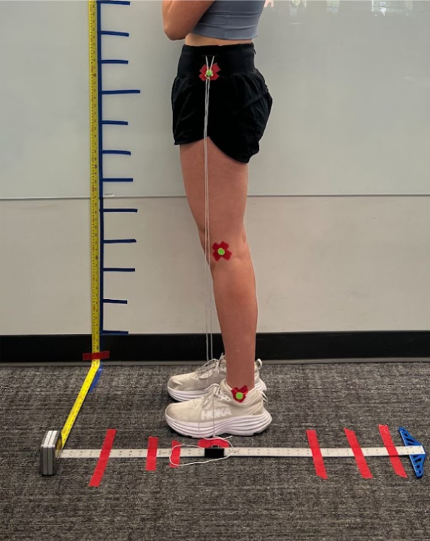

# jumping-kinematics-analysis
Biomechanical kinematic analysis of jumping mechanics using Kinovea motion capture software

# Jumping Mechanics: Kinematic Analysis
**University of Arizona | 2023**

## Overview
A biomechanical study of human jumping mechanics using motion capture 
software and a custom-built mechanical validation system. The study 
analyzed hip displacement across three distinct jump types to model 
and predict jump height, applying experimental design principles, 
calibration methodology, and error analysis.

## My Contributions
- Designed and executed a full experimental study of jumping mechanics 
  from methodology through data analysis and conclusions
- Captured multi-trial jump performance data using Kinovea motion 
  capture software, tracking hip displacement across three jump types
- Designed and built a custom string-pulley mechanical validation system 
  to cross-verify digital measurements and ensure consistency across trials
- Applied motion capture calibration methodology to ensure measurement 
  accuracy
- Performed error analysis and biomechanical data interpretation to 
  draw conclusions about jumping mechanics and energy transfer
- Documented findings in a formal technical report

## System Architecture
- **Motion Capture:** Kinovea software, hip displacement tracking, 
  multi-trial data collection across three jump types
- **Validation:** Custom string-pulley mechanical system for 
  cross-verification of digital measurements
- **Analysis:** Calibration methodology, error analysis, 
  biomechanical modeling for jump height prediction

## Key Results
- Successfully tracked hip displacement across three jump types 
  to predict jump height
- Validated digital motion capture measurements against physical 
  string-pulley reference system
- Applied error analysis to quantify measurement consistency 
  across trials
- Demonstrated relationship between hip displacement kinematics 
  and energy transfer in jumping mechanics

## Tools & Technologies
Kinovea · MATLAB · Experimental design · 
Motion capture calibration · Biomechanical data analysis

## System Photos

